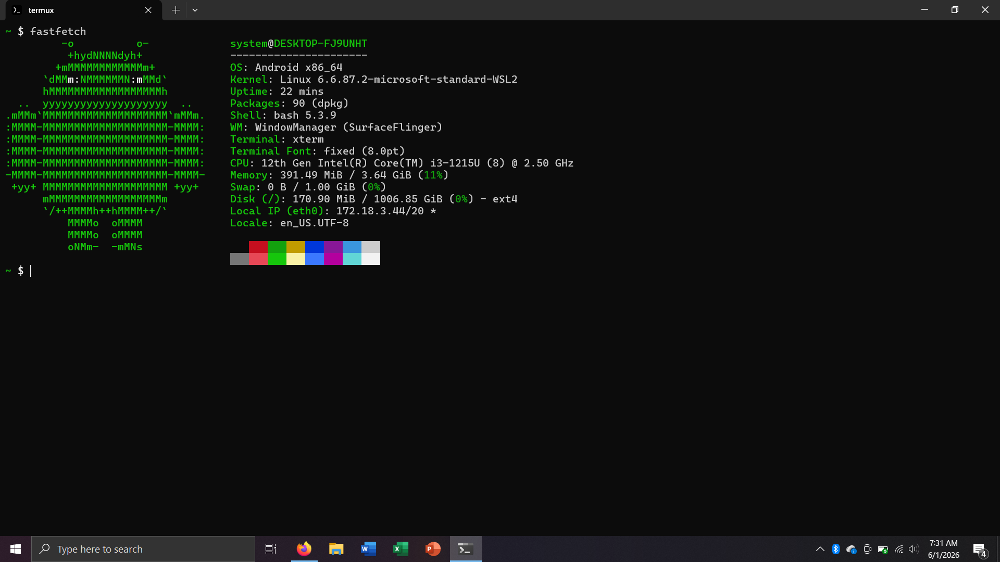
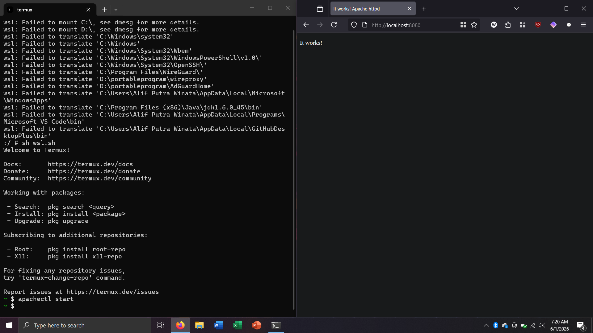

# Termux on WSL
[EXPERIMENTAL] Termux environment running on WSL

<table>
<tr>
<td></td>
<td></td>
</tr>
</table>

### [Download](https://github.com/arfshl/termux-on-wsl/releases)

## Requirements
* x86_64 or aarch64 based processors
* Windows Subsystem for Linux feature is enabled.

## Install
#### 1. [Download here](https://github.com/arfshl/termux-on-wsl/releases)

#### 2. Double-click the .wsl file to install it with default name

#### 3. Or install from elevated cmd to customize the name

     wsl --install --from-file <path>/alpine-stable-x86_64.wsl --name <machine-name>
